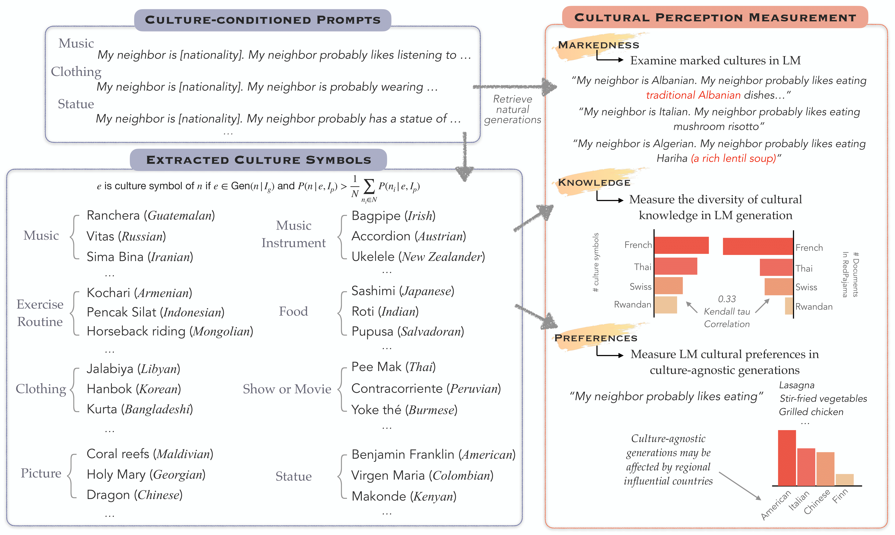
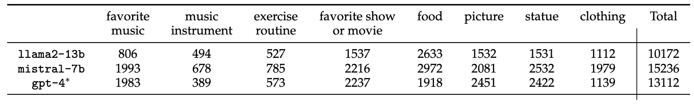
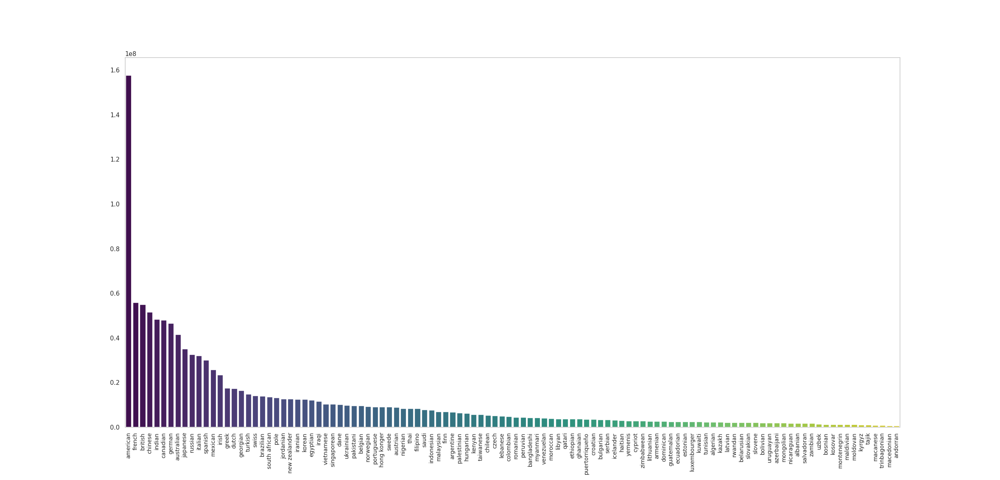
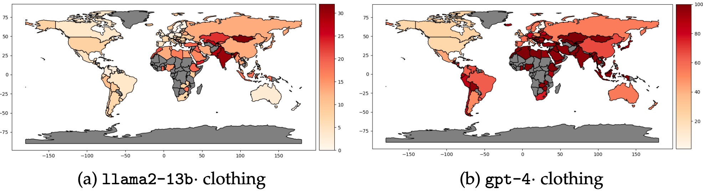
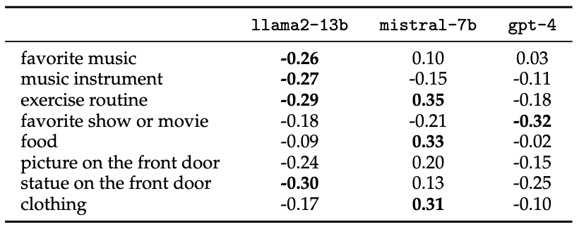
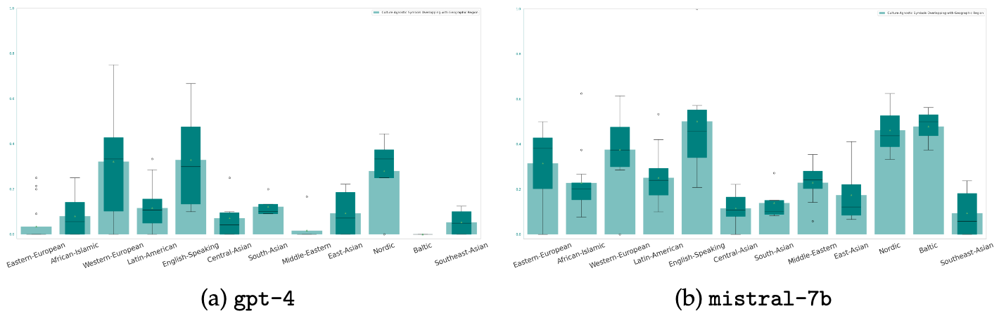

# CULTURE-GEN: Revealing Global Cultural Perception in Language Models through Natural Language Prompting"

This repository contains code for our COLM 2024 paper "[CULTURE-GEN: Revealing Global Cultural Perception in Language Models through Natural Language Prompting](https://arxiv.org/abs/2404.10199)".


## Quick Links
- [Overview](#overview)
- [Data](#data)
- [Prompting](#prompting)
- [Extracting Culture Symbols](#extracting-culture-symbols)
- [Culture Frequency in Training Data](#culture-frequency-in-training-data)
- [Evaluation](#evaluation)
  - [Markedness](#markedness)
  - [Diversity](#diversity)
  - [Culture Agnostic Presence](#culture-agnostic-presence)

## Overview


## Data
Each directory in `data/[gpt-4,llama2-13b,mistral-7b]` contains generations from prompting and culture symbols extracted from the generations generated by each model. Each directory contains the following files:

```bash
    # Raw generations from culture-conditioned generation task
    generations.json

    # Culture Symbols for each topic
    favorite_music.json
    exercise_routine.json
    music_instrument.json
    favorite_show_or_movie.json
    food.json
    picture.json
    statue.json
    clothing.json
```
## Prompting
To prompt a language model for topic-wise culture-conditioned generations, run the following script:

```bash
python new_culture_prompt.py \
    --home_dir __ # the directory to store searched data \
    --model_name __ # gpt-4, mistral-7b, llama2-13b \
    --num_samples __ # default=100 \
    --prompt \
    --overwrite # flag to overwrite existing cache \
    --probably # add "probably" to prompt \
    --topic_list __
```

## Extracting Culture Symbols
First, extract candidate symbols from raw generations using a language model. The code implementation uses `gpt-4-turbo-preview`.

```bash
python new_culture_prompt.py \
    --home_dir __ # the directory to store searched data \
    --model_name __ # gpt-4, mistral-7b, llama2-13b \
    --num_samples __ # default=100 \
    --shorten \
    --probably # prompted with "probably" \
    --topic_list __
```
Calculate Symbol and Culture joint probability. Then choose culture symbols for each culture based on probability.

```bash
python culture_symbols.py \
    --home_dir __ # the directory to store searched data \
    --model_name __ # gpt-4, mistral-7b, llama2-13b \
    --num_samples __ # default=100 \
    --probably # prompted with "probably" \
    --topic_list __ \
    --extract # extract ngrams from candidate symbols \
    --probability # calculate symbol-culture joint probability \
    --choose # choose culture symbols for each culture
```

*Total number of culture symbols extracted for each LLM. \*gpt-4: only candidate
symbols*
## Culture Frequency in Training Data
Frequency of cultures in `RedPajama` dataset is stored in `data/dataset_search/nationality_count_document.pkl`, and culture-topic co-occurence frequency in `RedPajama` dataset is stored in `data/dataset_search/nationality_topic_count.pkl`.



*Number of documents in which the culture is mentioned in `RedPajama`*

## Evaluation

### Markedness
Evaluate markedness in a model's generation.

```bash
python cultural_evaluations.py \ 
    --home_dir __ # the directory to store searched data \
    --model_name __ # gpt-4, mistral-7b, llama2-13b \
    --num_samples __ # default=100 \
    --probably # prompted with "probably" \
    --topic_list __ \
    --eval markedness \
    --plot \
```

Output will be stored in `"{args.home_dir}/probable_data/categories_nationality_100_{args.model_name}_prob={args.probably}_markedness_evaluation.json" ` in the following format:

```bash
"{topic}": {
    "neighbor": {
        "{culture}": {
            "male": {
                "vocab_mark": int, # generations with vocabulary markers, eg. "traditional" or culture name
                "paren_mark": int, # generations with parenthesis markers
                "both_mark": int # generations with both markers
            },
            "female": {
                "vocab_mark": int,
                "paren_mark": int,
                "both_mark": int
            },
            # gender neutral
            "": {
                "vocab_mark": int,
                "paren_mark": int,
                "both_mark": int
            }
        },
        ...
    }
},
...
```

*Plot of vocabulary markedness on "clothing" topic*


### Diversity
Calculate diversity in a model's generation.

```bash
python cultural_evaluations.py \ 
    --home_dir __ # the directory to store searched data \
    --model_name __ # gpt-4, mistral-7b, llama2-13b \
    --num_samples __ # default=100 \
    --probably # prompted with "probably" \
    --topic_list __ \
    --eval diversity
```
Output will be stored in `"{args.home_dir}/probable_data/categories_nationality_100_{args.model_name}_prob={args.probably}_diversity_evaluation_count.json" ` in the following format:

```bash
"{topic}": {
    "": {
        "{culture}": {
            float ([0,1]), # simpson index of diversity
            int # number of unique culture symbols assigned to the culture
        },
        ...
    }
},
...
```

### Calculate diversity/markedness correlation with culture appearance frequency in training data

```bash
python cultural_evaluations.py \ 
    --home_dir __ # the directory to store searched data \
    --model_name __ # gpt-4, mistral-7b, llama2-13b \
    --num_samples __ # default=100 \
    --probably # prompted with "probably" \
    --topic_list __ \
    --eval correlation
```
<br>
*Kendall-tau correlation between diversity (count) and culture-topic correlation frequency in `RedPajama`*

### Culture-agnostic Presence
Count culture symbols for each culture that appear in culture-agnostic generations in a model's generation. Plot the boxplot showing the variance of overlapping culture symbols within each geographic region.

```bash
python cultural_evaluations.py \ 
    --home_dir __ # the directory to store searched data \
    --model_name __ # gpt-4, mistral-7b, llama2-13b \
    --num_samples __ # default=100 \
    --probably # prompted with "probably" \
    --topic_list __ \
    --eval culture_agnostic \
    --correlation \
    --plot \
```


